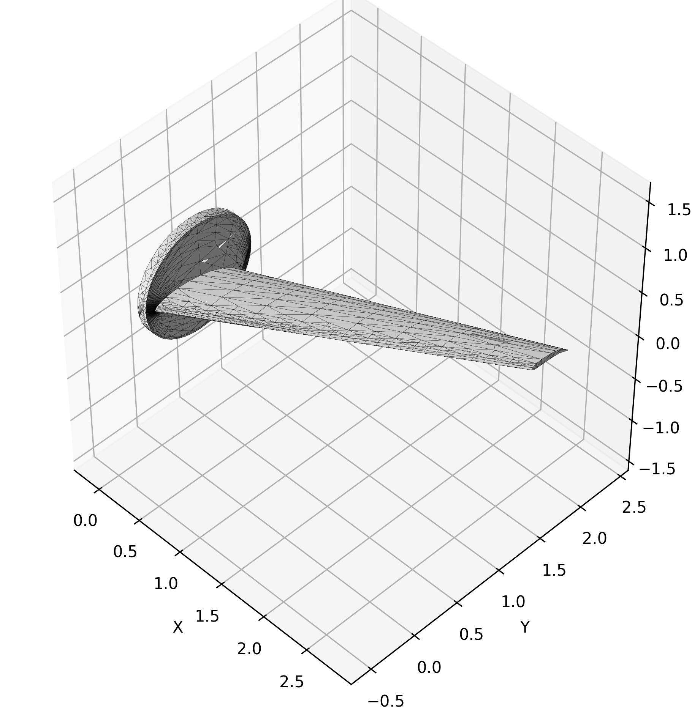

# NACA Airfoil Wing 3D Model Generator

## Usage

Run `render.py` It will generate some graphs in the `output` directory.

## Requirements

- **generate.py**: `Python 3.6+`, `NumPy`
- **render.py**: `Python 3.6+`, `NumPy`, `Matplotlib`
