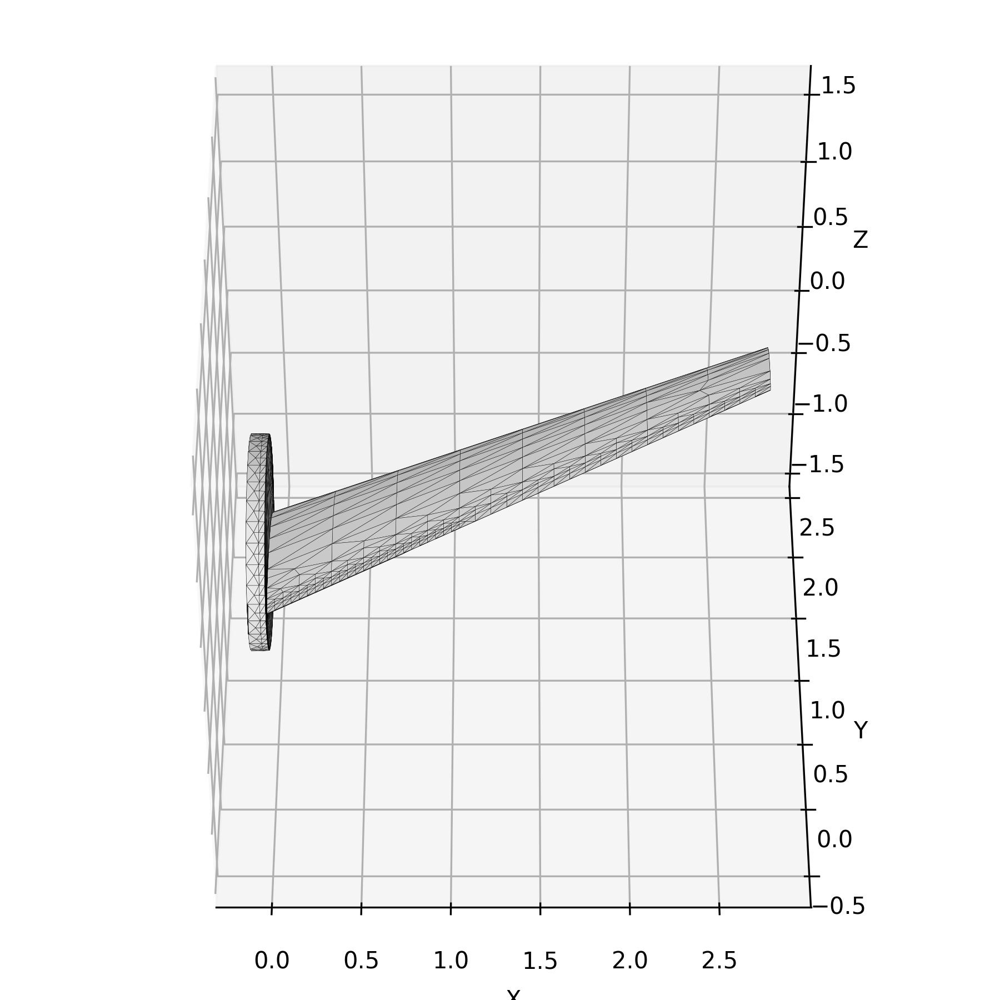

# NACA Airfoil Wing 3D Model Generator

## Usage

1. Run `generate.py` to generate the 3D model of the NACA airfoil wing. It will generate one 3D model named `model.obj` and some data files including faces, nodes, vertices, in the `output` directory.

2. Run `render.py` to render the 3D model. It will generate some graphs in the `output` directory.

## Requirements

- **generate.py**: `Python 3.6+`, `NumPy`
- **render.py**: `Python 3.6+`, `NumPy`, `Matplotlib`
